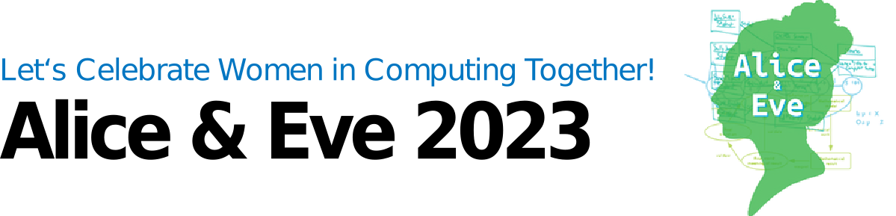
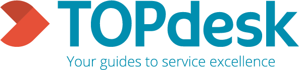

<!--  -->

Welcome to our free one-day workshop for celebrating women studying and working in computing!
Alice & Eve aims to bring together talents in the field of computing. The fourth edition of this workshop will be hosted on **27 October 2023** by the University of Amsterdam.

Alice and Eve event is inspired by the [BCS Lovelace Colloquium](https://bcswomenlovelace.bcs.org/) that started in 2008. For more details about earlier editions of Alice & Eve, see the websites of [2020](https://fmt.ewi.utwente.nl/events/aliceandeve2020/), [2021](https://aliceandeve.cs.ru.nl/) and [2022](https://alice-and-eve.github.io/2022/).

The event is held during a single day, and features:

- keynote talks,
- a poster contest, and
- an exhibition on women in computing.

Join us, and participate to our poster contest on the topic of your choice!

### Date:

Alice & Eve will take place on October 27th, 2023.

### Venue:

The workshop will be held at LAB42 at UvA Science Park.

### Registration:

The registration is free and includes coffee breaks, lunch and drinks. We welcome everyone of **all genders**, **from bachelor students to full professors**, to attend the event.

[SIGN UP HERE](https://docs.google.com/forms/d/e/1FAIpQLSeE9nok8a7G8ulDBM83JNBS9gpw6gkSOA836kO2iAQ4QZaLOw/viewform?usp=pp_url&entry.1084557700=Morning+Coffee&entry.1084557700=Lunch&entry.1084557700=Afternoon+Coffee&entry.1084557700=Drinks)

## Tentative Program

| Time |  |
|---|---|
| 09.30 - 10.00  | Welcome coffee + opening |
| 10.00 - 10.30  | Talk: **Ana Oprescu** - TBC |
| 10.30 - 11.00  | Talk: **Marcela Tuler de Oliveira** - TBC |
| 11.00 - 11.30  | Coffee Break  |
| 11.30 - 12.00  | Talk: **Carla Groenland** - Why combinatorics is useful for (theoretical) computer science  |
| 12.00 - 12.30  | Talk: **Ana Lukina** - TBC |
| 12.30 - 14.00  | Lunch + Poster session + Exhibition  |
| 14.00 - 14.30  | Sponsor Lightning Talks |
| 14.30 - 15.00  | Talk: **Marieke van Erp** - TBC |
| 15.00 - 15.30  | Talk: **Rianne van den Berg** - TBC|
| 15.30 - 16.00  | Coffee Break |
| 16.00 - 16.10  | Poster Prizes |
| 16.10 - 17.00  | Panel: **Closing the Gap: Addressing the Digital Divide through Accessible Technology**|
| 17.00 - 19.00  | Drinks and socials |

## Call for Posters

We invite all female students (Bachelor/Master/PhD) and early career researchers of computing and related subjects (in the broadest sense) to submit a poster.

To enter the poster contest, please write a half-page abstract (maximum 250 words) on the topic of your poster and submit it by 1 October 2023 through EasyChair: [https://easychair.org/conferences/?conf=ae23](https://easychair.org/conferences/?conf=ae23)

Your poster can be on any computing topic you like: from social networking to quantum computing and from medical image processing to formal verification. If it involves computers, we are interested. We welcome you to reuse any existing/published work or poster, no need to print it again.

Notifications will be sent out by 14 October 2023. Selected participants are expected to bring the poster (up to size A0 portrait or A1 landscape) described by their abstract with them to Amsterdam to present during the poster session. At the end of the day, prizes will be awarded for the winning posters in each category.

If you have any questions, don't hesitate to get in touch. We look forward to seeing you in Amsterdam!

## Exhibition

In addition to the keynote talks and the posters, there will be an exhibition which portrays thirty women in computing
and their most important contributions.

Some highlights of the exhibition:

- **Grace Hopper** who created the world’s first workable compiler;
- **Ada Lovelace** who is known for her work on the design of the ‘Analytics Machine’, the first ever general-purpose
  computer, and the first published algorithm;
- **Rosalind Picard** and her work on Affective Computing which is a combination of Computer Science, Psychology,
  Physiology and Cognitive Sciences;
- **Frances Brazier** who helped establish the first Internet Service Provider (ISP) in the Netherlands and Europe.

More information on these women, and many others, can be found at the exhibition and
the [online booklet](https://fmt.ewi.utwente.nl/events/aliceandeve2020/booklet-13-01-2020.pdf).

## Speakers

We have invited some inspiring women working on the cutting edge of computing. Confirmed speakers include:

- **Rianne van den Berg** - a principal researcher working on the intersection of deep learning and computational chemistry and physics for molecular simulation at Microsoft Research Amsterdam
- **Marieke van Erp** - a research group leader working on strengthening digital methods in humanities research at the Digital Humanities Research Lab
- **Carla Groenland** - a researcher in discrete mathematics and algorithms at TU Delft
- **Anna Lukina** - a computer scientist working on improving safety and interpretability of artificial intelligence at TU Delft
- **Ana Oprescu** - an assistant professor working on complex cyberinfrastructure at the University of Amsterdam
- **Marcela Tuler de Oliveira** - a telecommunications engineer and a thought leader in digital solutions for cross-organizational data sharing at TU Delft

More information and a detailed programme will follow soon.

## Organizing Committee

- [Romana Pernish](https://romana.pernisch.ch), Vrije Universiteit Amsterdam (VU)
- Dolly Sapra, Universiteit van Amsterdam (UvA)
- [Iris Groen](http://www.irisgroen.com), Universiteit van Amsterdam (UvA)
- Rebecca Reiffenhäuser, Universiteit van Amsterdam (UvA)
- Ilaria Battiston, Centrum Wiskunde & Informatica (CWI)
- Michelle Sweering, Centrum Wiskunde & Informatica (CWI)

## Advisory Committee

- [Peter Bloem](https://peterbloem.nl/), Vrije Universiteit Amsterdam (VU)
- [Judith Good](https://www.uva.nl/en/profile/g/o/j.a.good/j.a.good.html), Universiteit van Amsterdam (UvA)
- [Paola Grosso](https://staff.fnwi.uva.nl/p.grosso/index.html), Universiteit van Amsterdam (UvA)
- [Lynda Hardman](https://homepages.cwi.nl/~lynda/), Centrum Wiskunde & Informatica (CWI)
- [Animesh Kumar Trivedi](https://animeshtrivedi.github.io/), Vrije Universiteit Amsterdam (VU) 

## Steering committee

- [Marieke Huisman](https://people.utwente.nl/m.huisman), Universiteit Twente (UT)
- [Sophie Lathouwers](https://wwwhome.ewi.utwente.nl/~lathouwerssam/), Universiteit Twente (UT)
- [Cynthia Liem](https://www.cynthialiem.com/), Technische Universiteit Delft (TUD)
- [Alma Schaafstal](https://people.utwente.nl/a.m.schaafstal), Universiteit Twente (UT)
- [Alexander Serebrenik](https://www.win.tue.nl/~aserebre/), Technische Universiteit Eindhoven (TU/e)
- [Mariëlle Stoelinga](https://wwwhome.ewi.utwente.nl/~marielle/), Universiteit Twente (UT)

## Our Sponsors

We are currently looking for sponsors. Contact [Romana Pernisch](mailto:Romana Pernisch <r.pernisch@vu.nl>?subject=[Alice and Eve 2023] Sponsoring) for more information and a discussion on how your organization could support the 4th Alice and Eve workshop.

  

    

      
    

    

      
    

    

      
    

    

      
    

 

  

    

      
    

    

      
    

    

      
    

  

## Hosted by

  

    

      
    

    

      
    

    

      
    

  

## Contact Us

For questions regarding the workshop, please [contact the organizers](mailto:Romana Pernisch <r.pernisch@vu.nl>, Iris Groen <i.i.a.groen@uva.nl>, Ilaria Barriston <ilaria.battiston@cwi.nl>?subject=[Alice and Eve 2023] Question)!

