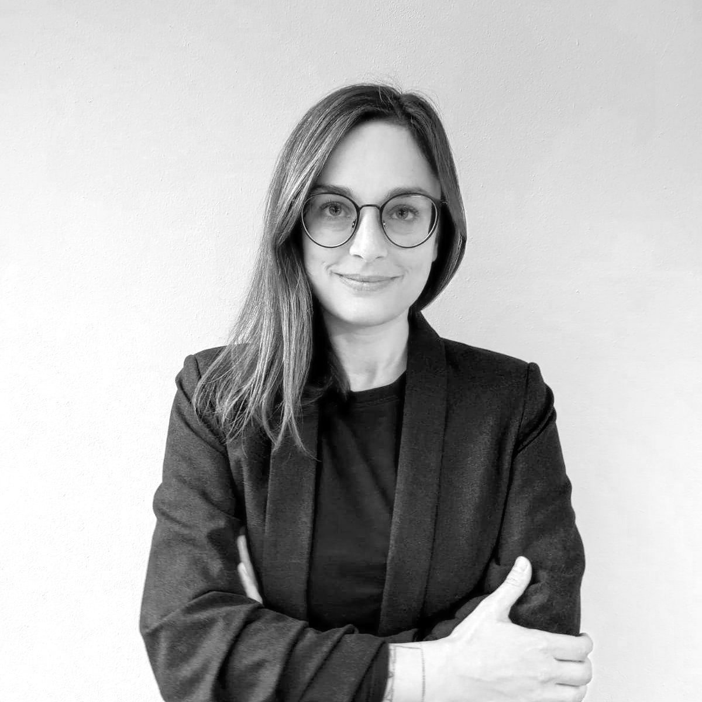

<!--  -->

Welcome to our free one-day workshop for celebrating women studying and working in computing!
Alice & Eve aims to bring together talents in the field of computing. The third edition of this workshop will be hosted
on **18 November 2022** by the Delft University of Technology.

Alice and Eve event is inspired by the [BCS Lovelace Colloquium](https://bcswomenlovelace.bcs.org/) that started in 2008. For more details about earlier editions of Alice & Eve, see the websites of [2021](https://aliceandeve.cs.ru.nl/)
and [2020](https://fmt.ewi.utwente.nl/events/aliceandeve2020/).

The event is held during a single day, and features:

- keynote talks,
- a poster contest, and
- an exhibition on women in computing.

Join us, and participate to our poster contest on the topic of your choice!

### Venue:

The workshop will be held at [Mondai House of AI @ Next Delft](https://mondai.tudelftcampus.nl/en/) at the TU Delft
campus.

### Registration:

The registration is free and includes coffee breaks, lunch and drinks. We welcome everyone of **all genders**, **from
bachelor students to full professors**, to attend the event.

If you would like to attend the workshop,
please [register here](https://mondai.tudelftcampus.nl/en/event/alice-and-eve-celebrating-women-in-computing/).

## Call for Posters

All women students (Bachelor/Master/PhD) and postdocs of computing and related subjects are invited to enter one of the
poster contests during Alice & Eve 2022. We interpret “related subjects” very broadly – we would like to involve
everybody in the area of computing in the broadest sense. If you are not sure, drop the organizers an email and we will
probably say yes.

To enter the poster contest, please write a one page abstract (minimum 250 words) on the topic of your poster. Your
abstract can be on any computing topic you like, e.g., it can be on a topic from social networking to quantum computing;
and from medical image processing to formal verification. If it involves computers, we’re interested.

Please submit your abstracts via [EasyChair](https://easychair.org/conferences/?conf=ae22).  
You will receive instructions about your poster with the acceptance notification e-mail.

### Important dates:

    Poster abstract submission deadline: 28 October 2022
    Notification of accepted posters: 4 November 2022

### PC Members

The program committee consists of the following members:

- Savvina Daniil (PhD Candidate @ CWI - Centrum Wiskunde & Informatica)
- Carolin Brandt (PhD Candidate @ TUD - Technische Universiteit Delft)
- Una Kelly (PhD Candidate @ UT - Universiteit Twente)
- Mitchell Olsthoorn (PhD Candidate @ TUD - Technische Universiteit Delft)
- Daphnee Chabal (PhD Candidate @ UvA - Universiteit van Amsterdam)
- Thomas Beelen(PhD Candidate @ UT - Universiteit Twente)

## Exhibition

In addition to the keynote talks and the posters, there will be an exhibition which portrays thirty women in computing
and their most important contributions.

Some highlights of the exhibition:

- **Grace Hopper** who created the world’s first workable compiler;
- **Ada Lovelace** who is known for her work on the design of the ‘Analytics Machine’, the first ever general-purpose
  computer, and the first published algorithm;
- **Rosalind Picard** and her work on Affective Computing which is a combination of Computer Science, Psychology,
  Physiology and Cognitive Sciences;
- **Frances Brazier** who helped establish the first Internet Service Provider (ISP) in the Netherlands and Europe.

More information on these women, and many others, can be found at the exhibition and
the [online booklet](https://fmt.ewi.utwente.nl/events/aliceandeve2020/booklet-13-01-2020.pdf).

## Invited Speakers

- **[Stefanie Roos](https://www.tudelft.nl/ewi/over-de-faculteit/afdelingen/software-technology/distributed-systems/people/stefanie-roos)**
  , Assistant Professor at Delft University of Technology

Stefanie Roos is an Assistant Professor at TU Delft, she works on decentralization with a focus on privacy-enhancing technologies and security. She has worked on censorship-resistant publication systems like Freenet, anonymous communication networks like Tor, and improved the scalability of blockchains.

**Talk: Resilient Publication in the Face of State Censorship**  
Internet censorship is wide-spread and plays a key role during protests, e.g., as the ones currently ongoing in Iran. In
this talk , I will first give an overview of different scenarios for censorship and methods for circumvention. I will
then discuss peer-to-peer-based approaches for publishing information in a censorship-resistant manner in more detail.
In contrast to most state-of-the-art censorship-resistance systems, such approaches remain applicable if a country
completely disconnects their national internet from the global internet.

- **[Judith Good](https://www.uva.nl/en/profile/g/o/j.a.good/j.a.good.html?cb)**, Professor at University of Amsterdam

Judith Good is Professor of Human Computer Interaction in the Informatics Institute at the University of Amsterdam, and director of the newly founded Digital Interactions Lab. She has degrees in psychology and artificial intelligence, and has worked at universities in both Europe and the United States. Her overarching research aim is to develop impactful technologies, designed with end users from the outset, which can have a transformative and empowering effect on the people who use them. Within this broad area, she has focussed on better understanding how people learn, and on how innovative technologies can best support their learning. She is particularly interested in working with people with disabilities, particularly autism, to design technologies which improve their lived experiences. Judith was also actively involved in a number of initiatives to support women and girls in STEM subjects whilst in the UK, and is continuing this work in the Netherlands.

**Talk: Towards a more inclusive digital society**  
Much of the research in human computer interaction takes the form of finding a solution to a ‘problem’, typically by
designing a new technology that can solve this problem, or at least go some way towards addressing it. The implicit
assumption is that the worse the problem, the more any solution, and hence the research contribution, will be noteworthy
and important. This creates tensions when designing for disability, with target users and/or their characteristics,
often being framed as somehow problematic. This, in turn, leads to “solutions” which are not fit for purpose. In this
talk, I will consider how we might take a different approach to technology design for disability, with the aim of
leading to positive changes in what/how/why we design.

- **[Elvan Kula](https://www.linkedin.com/in/elvan-kula/)**, Chapter Lead at ING Bank, Ph.D. student at Delft University
  of Technology

Elvan Kula is the Chapter Lead of Analytics & AI Research at ING. She is managing ‘AI for Fintech Research’, an ICAI lab, and research collaboration between ING and TU Delft. Next to her role as lab manager, she is a doctoral candidate at TU Delft, focusing on software effort estimation. Elvan is using automated techniques to both understand and improve software development processes in terms of efficiency and predictability.

**Talk: Enhancing the Understanding and Prediction of Software Delays at ING Using Machine Learning**  
In today’s rapidly changing world, the ability to be agile as well as predictable is essential to modern software
development companies. To become more predictable in software deliveries, it is essential to better understand which
factors affect the on-time delivery of software. We performed several large-scale case studies at ING to investigate
which social and technical factors affect the on-time delivery of software, how they interact with each other and how
their effects change over time. We have successfully integrated these influential factors using incremental learning for
delay prediction at ING. Our results indicate that the planning of software can be significantly improved by
incorporating team/process-related information and dynamic methods into analysis/predictive models.

- **[Peter Boncz](https://homepages.cwi.nl/~boncz/)**, Professor at Vrije University Amsterdam, Researcher at Centrum
  Wiskunde & Informatica (CWI)

Peter Boncz holds appointments as tenured researcher at CWI and professor at VU University Amsterdam. His academic background is in database systems, with the open-source column-store MonetDB the outcome of his PhD. He has a track record in bridging the gap between academia and commercial application, for which he received an ICT Regie Award in 2006. In 2008 he co-founded Vectorwise around the analytical database system by the same name which pioneered vectorized query execution. This initiative later led to the establishment of the R&D center of Databricks in The Netherlands. His later work in graph data management resulted in the non-commercial organization Linked Database Benchmark Council (LDBC), which now cooperates in the creation of the new ISO standard query languages SQL/PGQ and GQL. He also co-founded the SIGMOD workshops DAMON and GRADES, the <a href="https://dsdsd.da.cwi.nl"> Dutch Seminar on Data Systems Design </a> and he is general chair of <a href="https://cidrdb.org"> CIDR </a> (that will be held January 2023 in Amsterdam). His most recent new activity is in advising the new startup around <a href="https://duckdb.org"> DuckDB</a>, founded by CWI colleagues Hannes Mühleisen and Mark Raasveldt.

**Talk: Experiences in Systems Research with Impact.**  
The task of defining a research track with original contributions and impact can appear daunting, due to the many possible choices of direction that one can make, but also the increasing maturity of the field of computing, its growth and the increased sense of competition that comes with that. The systems side of computer science, where I am active, has very many direct applications outside academia, and my personal preference has been to select topics and direction that can make an impact there.  This talk will be structured around my personal experiences in the area of data systems research in the past decades. I will share some of my viewpoints on fundamental vs. applied research, trends in research practice that can diminish the impact of research, and strategies to make research more impactful, including community building, communication, open-source and spin-offs; and hope to discuss these with the audience as well.

- **[Mariëlle Stoelinga](https://wwwhome.ewi.utwente.nl/~marielle/)**, Professor at University of Twente

Mariëlle Stoelinga is a professor of risk management, both at the Radboud University Nijmegen, and the University of Twente, in the Netherlands. She leads PrimaVera, a large collaborative project on Predictive Maintenance in the Dutch National Science Agenda NWA. She also received a prestigious ERC consolidator grant. 

Further  Stoelinga is the scientific programme leader  Risk Management Master, a part-time MSc programme for professionals. She holds an MSc and a PhD degree from Radboud University Nijmegen, and has spent several years as a post-doc at the University of California at Santa Cruz, USA.

**Talk: Predictive Maintenance.**  
No more train delays. The grand vision of Predictive Maintenance (PdM) using data analytics to predict potential failures so well, so these can be prevented by performing maintenance exactly when and where needed --- thus resulting in switches, signaling systems and signals experiencing no zero downtime.
 
While predictive maintenance has its roots in mechanical and civil engineering, I will
in this talk elaborate on how computer science lies at the heart of many challenges in predictive maintenance, especially when it comes to automation of the solutions, their specification and verification, multi-stage optimization, the complexity of IT architecture, as well as the organizational objectding of the solutions. Thus, I hope to inspire the audience to contribute to this beautiful, relevant and exciting field.

<!--
- **[Helle Hvid Hansen](https://www.rug.nl/staff/h.h.hansen/?lang=en)**, Associate Professor at University of Groningen

Helle Hvid Hansen is an Associate Professor
and Rosalind Franklin Fellow at the Bernoulli Institute for Mathematics, Computer Science and Artificial Intelligence at the University of Groningen. Her research focuses on logic and semantics of computation, and her interests include the development of logical and (co)algebraic methods for 
She has been a member or chair of numerous international program committees, she is a founding editor of the open-access journal Compositionality, and a board member of the Dutch Association for Logic and Philosophy of the Exact Sciences (VvL).

**Talk: Reasoning about games vs programs.**  
Software systems are built from many interacting components, and analyzing whether a component behaves correctly cannot be done without considering the behavior of the other components. In formal verification, the approach taken to analyze such systems is often game-theoretic. Game logic, introduced by Parikh in 1983, provides a formal framework for reasoning about what agents can achieve in interactions that can be modelled as determined 2-player games. Despite being introduced almost 40 years ago, and in contrast with the situation for the closely related program logic PDL, several fundamental questions about game logic have only recently been answered or remain open. In this talk, I will survey some of these results and open questions.

-->

- **[Jaya Baloo](https://en.wikipedia.org/wiki/Jaya_Baloo)**, Chief Information Security Officer at AVAST

Jaya Baloo is Avast’s Chief Information Security Officer (CISO) and joined Avast in October 2019. Previously, Ms. Baloo held the position of CISO at KPN, the largest telecommunications carrier in the Netherlands, where she established and led its security team whose best practices in strategy, policy, and security operations are today recognized as world leading. Prior to this, Ms. Baloo also held the position of Practice Lead Lawful Interception at Verizon, and worked at France Telecom as a Technical Security Specialist.

Ms. Baloo is formally recognized within the list of top 100 CISOs globally and ranks among the top 100 security influencers worldwide. In 2019, she was also selected as one of the fifty most inspiring women in the Netherlands by Inspiring Fifty, a non-profit aiming to raise diversity in technology by making female role models in technology more visible.  
Ms. Baloo has been working in the field of information security, with a focus on secure network architecture, for over 20 years and sits on the advisory boards of the NL’s National Cyber Security Centre, PQCrypto and the EU Quantum Flagship’s Strategic Advisory Board. She serves on the audit committee of TIIN capital, a cybersecurity fund, and is also a member of the IT Committee of Sociale Verzekeringsbank. She is a board member of the cybersecurity firm NIXU in Finland. Since 2021 she is also a board member of the RvT of the Dutch Broadcasting station, the NOS.  
Ms. Baloo has spoken widely at high profile conferences such as RSA, TEDx and Codemotion on topics including Lawful Interception, VoIP, Mobile Security, Cryptography, and Quantum Communications Networks. Additionally, Ms. Baloo is a faculty member of the Singularity University since 2017, where she regularly lectures.

## Panel

### Topic

Trust in AI - Society perspective: Past, Present, Future

### Moderator

- **[Cynthia Liem](https://www.cynthialiem.com/)**, Associate Professor, Delft University of Technology

Cynthia Liem is an Associate Professor at the Multimedia Computing Group. 
In 2007 and 2009, she obtained her BSc and MSc degree in Media and Knowledge Engineering (Computer Science) at the TU Delft, 
after which she continued pursuing a PhD at the same institution (defended in 2015). 
Besides, she obtained the BMus (2009) and MMus (2011) degree in classical piano performance at the Royal Conservatoire in The Hague.

### Panelists

- **[Zeki Erkin](https://www.tudelft.nl/staff/z.erkin/?cHash=7bdc736d96a12a4492bb7e8de0e2987a)**, Associate Professor,
  Delft University of Technology

Zeki Erkin is an associate professor in the Cyber Security Group, Delft University of Technology. He received his PhD degree on “Secure Signal Processing” in 2010 from Delft University of Technology where he has continued his research on Privacy Enhancing Technologies, particularly on Computational Privacy. His interest is on protecting sensitive data from malicious entities and service providers using cryptographic tools. While his interest on solutions based on provably secure cryptographic protocols is the core of his research, Dr. Erkin is also investigating distributed trust for building such protocols without trusted entities.

- **[Maria Luce Lupetti](https://www.marialucelupetti.com/)**, Assistant Professor, Delft University of Technology

Maria Luce Lupetti is an Assistant Professor in Design at the faculty of Industrial Design Engineering, TU Delft (
  NL). She studied 'Industrial Design' at ISIA Roma Design (B.A.) and pursued a master in 'Ecodesign' and a PhD in '
  Production, Managment and Design' at Politecnico di Torino (M.Sc.) in Italy. Her current research, at the intersection
  of design, ethics, AI and robotics, is focused on understanding and designing responsible human-technology relations.
  Specifically, she investigates how critical design methods can be used to promote conscious and responsible approaches
  to AI systems development.

- **[Seyran Khademi](https://www.tudelft.nl/ewi/over-de-faculteit/afdelingen/intelligent-systems/pattern-recognition-bioinformatics/computer-vision-lab/people/seyran-khademi)**, Assistant Professor, Delft University of Technology

Since April 2021, Seyran Khademi is an Assistant Professor at the faculty of Architecture and the Built Environment (ABE) and the co-director of AiDAPT lab (AI for Design, Analysis, and Optimization in Architecture and the Built Environment). She is working as an interdisciplinary researcher between Computer Vision lab and Architecture Department at ABE. Her research interest lies at the intersection of Data, Computer Vision and Deep Learning in the context of man-made imagery including illustrations and visual data for Architectural Design.

## Program

| Time |  |
|---|---|
| 09.30 - 10.00  | Welcome coffee |
| 10.00 - 10.15  | Opening |
| 10.15 - 10.45  | Talk: **Stefanie Roos** - Resilient Publication in the Face of State Censorship |
| 10.45 - 11.00  | Coffee Break  |
| 11.00 - 11.30  | Talk: **Judith Good** - Towards a more inclusive digital society |
| 11.30 - 12.00  | Talk: **Elvan Kula** - Enhancing the Understanding and Prediction of Software Delays at ING Using Machine Learning |
| 12.00 - 14.00  | Lunch |
| 13.00 - 14.00  | Poster exhibition  |
| 14.00 - 14.30  | Talk: **Peter Boncz** - Experiences in Systems Research with Impact |
| 14.30 - 15.00  | Talk: **Mariëlle Stoelinga** - Predictive Maintenance |
| 15.00 - 15.30  | Coffee break  |
| 15.30 - 16.00  | On stage interview: **Jaya Baloo**  |
| 16.00 - 16.15  | Poster prizes  |
| 16.15 - 17.00  | Panel - **Trust in AI - Society perspective: Past, Present, Future** |
| 17.00 - 18.00  | Drinks and socials |

## Posters
These posters were presented during the poster competition at Alice & Eve 2022:
(not all posters are available yet, we will update this page as soon as we have them)

<object class="poster-image" data="assets/posters/poster-sanja-lukumbuzya.pdf" alt="Poster by Sanja Lukumbuzya">
alt : <a href="assets/posters/poster-sanja-lukumbuzya.pdf">poster</a>
</object>
<a href="assets/posters/poster-sanja-lukumbuzya.pdf"> <h4>Ontology-Enriched Data Management with Partially Complete Information</h4> </a>
Sanja Lukumbuzya

<object class="poster-image" data="assets/posters/Poster-una-kelly.png" alt="Poster by Una Kelly">
alt : <a href="assets/posters/Poster-una-kelly.png">poster</a>
</object>
<a href="assets/posters/Poster-una-kelly.png"> <h4>Exploring Face De-Identification using Latent Spaces</h4> </a>
Una Kelly

<object class="poster-image" data="assets/posters/eileen-kapel.jpg" alt="Poster by Eileen Kapel">
alt : <a href="assets/posters/eileen-kapel.jpg">poster</a>
</object>
<a href="assets/posters/eileen-kapel.jpg"> <h4>Incident Management in a Software-Defined Business: A Case Study</h4> </a>
Eileen Kapel

<object class="poster-image" data="assets/posters/Alice & Eve - poster -- Jin Huang.pdf" alt="Poster by Jin Huang">
alt : <a href="assets/posters/Alice & Eve - poster -- Jin Huang.pdf">poster</a>
</object>
<a href="assets/posters/Alice & Eve - poster -- Jin Huang.pdf"> <h4>Debiasing Recommendations When Selection Bias and User Preferences Are Dynamic</h4> </a>
Jin Huang

<object class="poster-image" data="assets/posters/Alice&Eve-Poster-Mahla.png" alt="Poster by Fatemeh Alizadeh">
alt : <a href="assets/posters/Alice&Eve-Poster-Mahla.png">poster</a>
</object>
<a href="assets/posters/Alice&Eve-Poster-Mahla.png"> <h4>A Critique of the Making Invisible of A.I. Policing</h4> </a>
Fatemeh Alizadeh

<object class="poster-image" data="assets/posters/Ana Baltaretu - EV Mask RCNN - poster.jpg" alt="Poster by Ana Băltărețu">
alt : <a href="assets/posters/Ana Baltaretu - EV Mask RCNN - poster.jpg">poster</a>
</object>
<a href="assets/posters/Ana Baltaretu - EV Mask RCNN - poster.jpg"> <h4>EV-Mask-RCNN: Instance Segmentation in Event-based Videos</h4> </a>
Ana Băltărețu

<object class="poster-image" data="assets/posters/Poster_AC-TowardsSustainability_June-SALLOU.png" alt="Poster by June Sallou">
alt : <a href="assets/posters/Poster_AC-TowardsSustainability_June-SALLOU.png">poster</a>
</object>
<!-- 1st price -->
<a href="assets/posters/Poster_AC-TowardsSustainability_June-SALLOU.png"> <h4>Approximate Computing: A way towards Sustainability</h4> </a>
June Sallou

<object class="poster-image" data="assets/posters/AliceEve22_Tanvina_Poster_A1-1.jpg" alt="Poster by Tanvina Patel">
alt : <a href="assets/posters/AliceEve22_Tanvina_Poster_A1-1.jpg">poster</a>
</object>
<a href="assets/posters/AliceEve22_Tanvina_Poster_A1-1.jpg"> <h4>Reducing Bias in Automatic Speech Recognition Systems</h4> </a>
Tanvina Patel

<object class="poster-image" data="assets/posters/poster-Kyana-van-Eijndhoven.png" alt="Poster by Kyana van Eijndhoven">
alt : <a href="assets/posters/poster-Kyana-van-Eijndhoven.png">poster</a>
</object>
<a href="assets/posters/poster-Kyana-van-Eijndhoven.png"> <h4>Supporting teams during crises</h4> </a>
Kyana van Eijndhoven

<object class="poster-image" data="assets/posters/AliceandEvePoster_Larissa2022.pdf" alt="Poster by Larissa Capobianco Shimomura">
alt : <a href="assets/posters/AliceandEvePoster_Larissa2022.pdf">poster</a>
</object>
<!-- 3rd price -->
<a href="assets/posters/AliceandEvePoster_Larissa2022.pdf"> <h4>Graph Generating Dependencies for Graph Data Profiling</h4> </a>
Larissa Capobianco Shimomura

<object class="poster-image" data="assets/posters/Poster_Loes_Kruger_A&E22.pdf" alt="Poster by Loes Kruger">
alt : <a href="assets/posters/Poster_Loes_Kruger_A&E22.pdf">poster</a>
</object>
<a href="assets/posters/Poster_Loes_Kruger_A&E22.pdf"> <h4>Investigation Sprayer Issue Detection in Alfa Laval's PureSOx using Data-Driven Approaches</h4> </a>
Loes Kruger

<object class="poster-image" data="assets/posters/Burcu_Alice_Eve_Poster.png" alt="Poster by Burcu Sayin">
alt : <a href="assets/posters/Burcu_Alice_Eve_Poster.png">poster</a>
</object>
<a href="assets/posters/Burcu_Alice_Eve_Poster.png"> <h4>Towards Building Reliable Hybrid Human-Machine Classifiers</h4> </a>
Burcu Sayin

<object class="poster-image" data="assets/posters/SOK-poster-azqa.png" alt="Poster by Azqa Nadeem">
alt : <a href="assets/posters/SOK-poster-azqa.png">poster</a>
</object>
<!-- got public award, -->
<a href="assets/posters/SOK-poster-azqa.png">
<h4>SoK: Explainable Machine Learning for Computer Security Applications</h4>
</a>
Azqa Nadeem

<object class="poster-image" data="assets/posters/Fazekas_poster.pdf" alt="Poster by Katalin Fazekas">
alt : <a href="assets/posters/Fazekas_poster.pdf">poster</a>
</object>
<a href="assets/posters/Fazekas_poster.pdf"> <h4>Incremental Inprocessing in SAT Solving</h4> </a>
Katalin Fazekas

<object class="poster-image" data="assets/posters/AliceAndEvePoster-Carolin-Brandt.pdf" alt="Poster by Carolin Brandt">
alt : <a href="assets/posters/AliceAndEvePoster-Carolin-Brandt.pdf">poster</a>
</object>
<!-- 2nd price -->
<a href="assets/posters/AliceAndEvePoster-Carolin-Brandt.pdf"> <h4>What Developers Change Before Accepting Automatically Amplified Tests</h4> </a>
Carolin Brandt

<object class="poster-image" data="assets/posters/Alice_and_Eve_2022_poster_IvD.pdf" alt="Poster by Imara van Dinten">
alt : <a href="assets/posters/Alice_and_Eve_2022_poster_IvD.pdf">poster</a>
</object>
<a href="assets/posters/Alice_and_Eve_2022_poster_IvD.pdf"> <h4>CPS Performance Issues: From pebble to avalanche</h4> </a>
Imara van Dinten

<object class="poster-image" data="assets/posters/A&E_poster_miriam-garcia-soto.pdf" alt="Poster by Miriam García Soto">
alt : <a href="assets/posters/A&E_poster_miriam-garcia-soto.pdf">poster</a>
</object>
<a href="assets/posters/A&E_poster_miriam-garcia-soto.pdf"> <h4>Synthesis of Hybrid Systems from Multimodal Datasets</h4> </a>
Miriam García Soto

## Organizing committee

<a href="https://burcuku.github.io/home/" target="_blank">Burcu Kulahcioglu Ozkan</a>

Delft University of Technology

<a href="https://andraionescu.github.io/" target="_blank">Andra-Denis Ionescu</a>

Delft University of Technology

<a href="https://carolin-brandt.de/" target="_blank">Carolin Brandt</a>

Delft University of Technology

## Steering committee

- [Marieke Huisman](https://people.utwente.nl/m.huisman), University of Twente (UT)
- [Sophie Lathouwers](https://wwwhome.ewi.utwente.nl/~lathouwerssam/), University of Twente (UT)
- [Cynthia Liem](https://www.cynthialiem.com/), Delft University of Technology (TUD)
- [Alma Schaafstal](https://people.utwente.nl/a.m.schaafstal), University of Twente (UT)
- [Alexander Serebrenik](https://www.win.tue.nl/~aserebre/), Eindhoven University of Technology (TU/e)
- [Mariëlle Stoelinga](https://wwwhome.ewi.utwente.nl/~marielle/), University of Twente (UT)

## Our Sponsors

  <h2>PLATINUM</h2>
  

    

      
    

    

      
    

    

      
    

  

  <h2>GOLD</h2>
  

    

      
    

    

      <h3>DuckDB Foundation</h3>
      
    

  

  

    

      
    

    

      
    

  

  <h2 class="margin-top">SILVER</h2>
    

      

        
      

        

            
        

    

  <h2 class="margin-top">BRONZE</h2>
  

    

      
    

    

      
    

    

      
    

  

## Contact Us

For questions regarding the workshop, please [contact the organizers](mailto:Burcu Özkan <B.Ozkan@tudelft.nl>, Andra
Ionescu <A.Ionescu-3@tudelft.nl>?subject=[Alice and Eve 2022] Question)!

